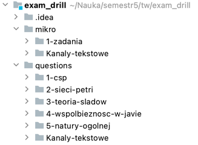
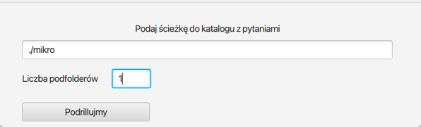
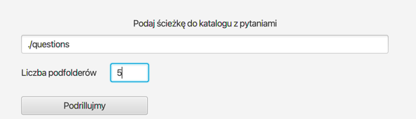
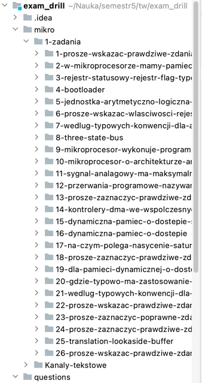

# Exam drill

## Uwaga na strukturę katalgów!

W folderze exam_drill umieszczamy folder z pytaniami (backup z discorda)  
Folder z pytaniami powinien mieć format jak ten z pytaniami z egzaminu z TW.  
przykład:  
        